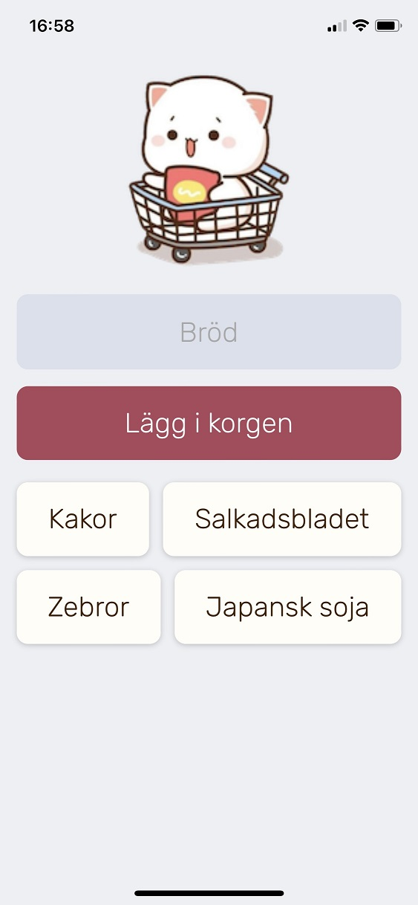

# Add To Cart app

## Description
A great help when shopping at the grocery store. Plan your shopping at home by adding items to the list. Then to remove from the list, click each item when you put it in the shopping cart.

This is a web application but can easily be configured to act as a mobile app on your Android or iPhone by "Add to Home Screen" (see screenshot below). 

By the way, I had to do this demo version of the app which uses another database than our family use :-)

 

## Technologies
- HTML
- CSS
- JavaScript
- Firebase database

## Live link
The app is deployed here:
[https://mob-app-demo.netlify.app](https://mob-app-demo.netlify.app)

Please feel free to visit and click around!
